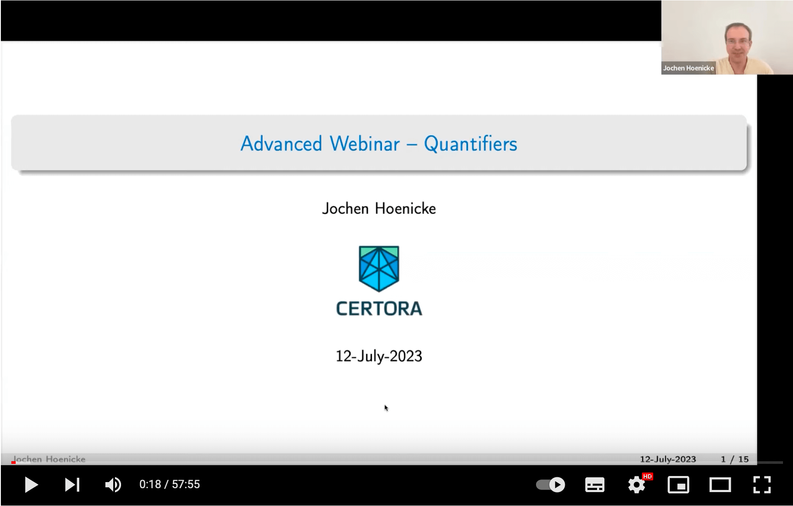

# QuantifierExamples
This repository contains examples of Certora specs using quantifiers and
quantified invariants.  These examples were presented in the advanced webinar
on quantifiers:

[](https://youtu.be/IEB6adfjsA8)

- [Recording on YouTube](https://youtu.be/IEB6adfjsA8)
- [Slides from the Webinar](./webinar-quantifiers.pdf)


The following examples were used in the Webinar.
The first two are based on existing code.

- [EnumerableSet](./EnumerableSet) from [OpenZeppelin][1]: We show that the set view and the array view are always consistent and all methods work as expected.

Run this spec via
```certoraRun set.conf``` from `EnumerableSet`.

[A report of this run](https://prover.certora.com/output/1902/b94c8a31f9fc4194a44c27ecc7c8d730/?anonymousKey=e16609b3cdbb2cf22360ebe8b1b3a14c4d22a9ea)

- [DoubleLinkedList](./DoublyLinkedList) from [Morpho][2]: We show the consistency of linkage: the next and prev pointers match for each element.

Run this spec via
```certoraRun linkedCorrectly.conf``` from `DoublyLinkedList`.

[A report of this run](https://prover.certora.com/output/1902/4220b9637ebe44d39ea6faebd4f1aea4?anonymousKey=4dba0365aa9ebd0e9a17ae7b473ab1861bdf1b28)

- [LinkedList](./SinglyLinkedList): For a simple struct-based singly-linked list we show correctness,
including the fact that each element in the list is reachable from the head.

Run this spec via 
```certoraRun list.conf``` from `SinglyLinkedList`.

[A report of this run](https://prover.certora.com/output/1902/f72caa3390c4445b9ef8d83b4c433744?anonymousKey=aec282acfe003fb3633350e1c55ee85b348c571b)

[1]: https://github.com/OpenZeppelin/openzeppelin-contracts/blob/master/contracts/utils/structs/EnumerableSet.sol "EnumerableSet from OpenZeppelin"
[2]: https://github.com/morpho-org/morpho-data-structures/blob/main/src/DoubleLinkedList.sol "DoubleLinkedList from Morpho"
